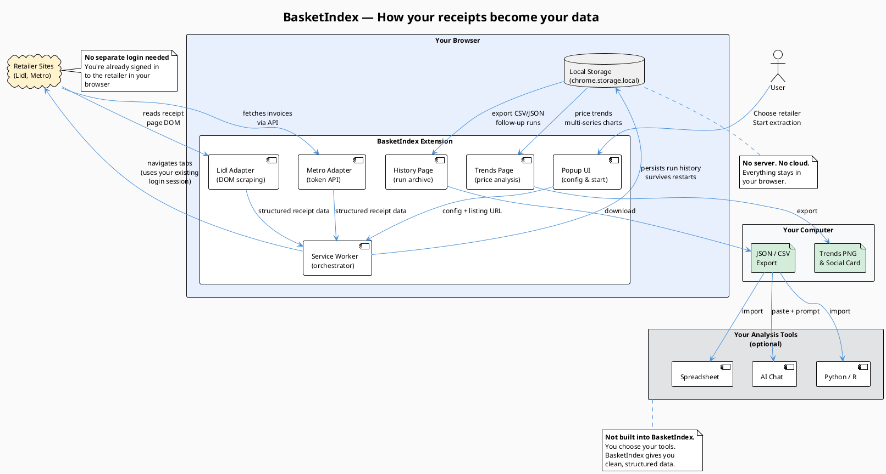
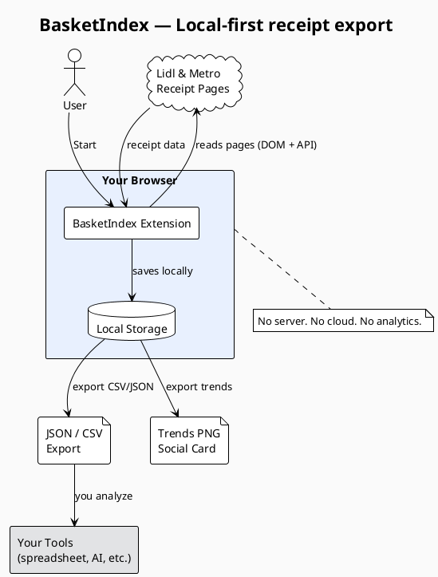

# BasketIndex — Public Architecture Diagram

## Architecture

BasketIndex is a Chrome MV3 browser extension with four runtime layers:

1. **Popup UI** — user selects retailer, configures extraction, and starts jobs.
2. **Service Worker** — orchestrates extraction: manages browser tabs, dispatches adapters, handles retry/recovery, and persists state to `chrome.storage.local`.
3. **Adapter layer** (`adapters/lidl/`, `adapters/metro/`) — retailer-specific extraction logic. Lidl uses DOM scraping on receipt pages; Metro uses API calls (token-based). Both produce BasketIndex's normalized receipt schema.
4. **Analysis UI** — History page (run archive, follow-up extraction, export), Trends page (price trend charts, tooltips, evidence table, social card export).

The privacy-first design comes from what is **absent**: no server, no credential collection, no analytics, no cloud storage. All data stays in the user's browser. Export is user-initiated via the Chrome downloads API.

### Data flow

```
User's browser (already logged in to retailer)
    │
    ▼
Popup UI              → config + start extraction
    │
    ▼
Service Worker        → orchestrates discovery + extraction
    │
    ├── Lidl adapter  → DOM scraping on purchase pages
    └── Metro adapter → token-based API extraction
    │
    ▼
chrome.storage.local  → run history, normalized receipts
    │
    ├── History page  → export CSV / JSON / follow-up runs
    └── Trends page   → price trends, evidence table, social card
    │
    ▼
User's own tools      → spreadsheet, Python, AI chat (optional)
```

---

## Diagram: PlantUML source



### Diagram title

**"BasketIndex — How your receipts become your data"**

### Explanatory copy

> BasketIndex runs entirely in your browser. It reads your purchase history from Lidl and Metro using your existing login — no separate accounts, no password sharing. The extension extracts your receipts into structured JSON and CSV, storing everything locally. History keeps your runs organized with follow-up extraction support. Trends visualizes price changes over time, and you can export analysis graphics or social share cards. From there, you can analyze your data with any tool you choose — a spreadsheet, Python, or an AI assistant.
>
> No server. No analytics. Your data, your tools.

### Simplified version


