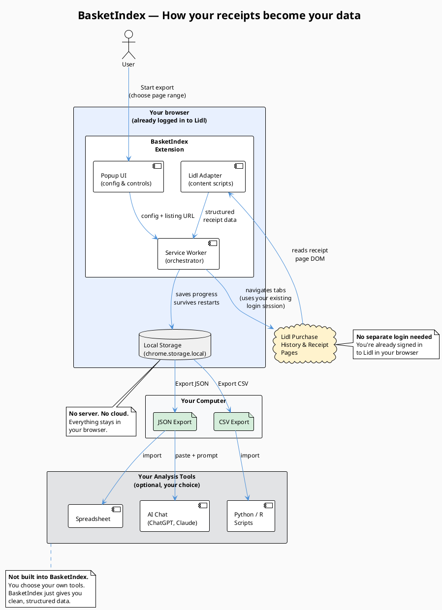
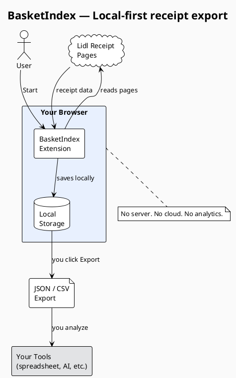

# BasketIndex — Public Architecture Diagram

## Architecture Assessment (short)

BasketIndex is a Chrome MV3 browser extension with three runtime layers:

1. **Popup UI** — user configures page range and starts the export.
2. **Service Worker** — orchestrates the job: opens browser tabs on the user's already-authenticated retailer pages, dispatches content scripts, manages a receipt queue with retry/recovery, and persists state to `chrome.storage.local`.
3. **Adapter layer** (`adapters/lidl/`) — content scripts that read the retailer's receipt page DOM and extract structured data. Lidl is the first adapter; the architecture supports adding more retailers by creating new adapter directories without changing the core engine.

The privacy-first design comes from what is **absent**: no server, no credential collection, no analytics, no cloud storage. All data stays in the user's browser. Export is user-initiated via the Chrome downloads API.

### Data flow (simplified)

```
User's browser (already logged in to retailer)
    │
    ▼
Purchase-history pages → listing extractor → receipt URLs
    │
    ▼
Receipt detail pages   → detail extractor   → structured receipt data
    │
    ▼
chrome.storage.local   → job state, receipt queue, completed data
    │
    ▼
Downloads API          → JSON / CSV files on user's disk
    │
    ▼
User's own tools       → spreadsheet, Python, ChatGPT, Claude (optional)
```

---

## Diagram: PlantUML source

Copy this into any PlantUML renderer (plantuml.com, VS Code plugin, etc.)



### Diagram title

**"BasketIndex — How your receipts become your data"**

### Explanatory copy for a public post

> BasketIndex runs entirely in your browser. It reads your Lidl purchase history pages using your existing login session — no separate accounts, no password sharing. The extension extracts your receipts into structured JSON and CSV, storing everything locally. When you click Export, the files save to your computer. From there, you can analyze them with any tool you choose — a spreadsheet, a Python script, or an AI chat tool like ChatGPT or Claude.
>
> No server. No analytics. Your data, your tools.

### Lighter version recommendation

For a social post where vertical space is tight (e.g., Twitter/X, LinkedIn), use this simplified 4-box version:



The lighter version fits in a single tweet or as a GitHub social preview image while still communicating the core privacy message.
